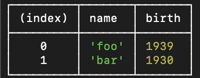

# 노드 내장 객체

노드는 기본적인 내장 객체를 제공한다. 이 객체들은 따로 설치하지 않아도 바로 사용할 수 있다.

### global

브라우저의 window와 같은 전역 객체로, 모든 파일에서 접근할 수 있으며 window.open 메서드를 open으로 생략하여 사용할 수 있는 것처럼 global도 생략이 가능하다. 노드에서 모듈을 불러올 때 사용하는 require 함수도 정확히는 global.require에서 global이 생략된 것이다. 마찬가지로 console 객체도 global.console에서 생략된 것이다.

> 노드는 DOM이나 BOM이 존재하지 않으므로, window와 document 객체는 노드에서 사용할 수 없으며, 따라서 노드에서 두 객체를 사용하면 에러가 발생한다.

global이 전역 객체라는 점을 이용해 모듈 간의 데이터를 공유하는 데 사용할 수도 있지만, 이를 남용하게 되면 프로그램이 커질수록 어떤 모듈에서 global 객체에 값을 대입했는지 찾기 힘들어지기 때문에 유지보수가 어려워지는 문제점이 발생하므로 global 객체를 사용하는 것보다는 모듈 형식으로 값을 불러와 사용하는 것이 좋다.

### console

global 객체 안에 들어 있는 객체로, 보통 디버깅을 위해 사용되게 된다.

console 객체 안에는 다음과 같은 메서드들이 들어 있다:

- console.time(레이블): console.timeEnd(레이블)과 대응되어 같은 레이블을 가진 time과 timeEnd 사이의 시간을 측정한다.
- console.log(내용): 평범한 로그를 콘솔에 표시하며, console.log(내용, 내용, ...)처럼 여러 내용을 표시할 수도 있다.
- console.error(에러 내용): 에러를 콘솔에 표시한다.
- console.table(배열): 배열의 요소로 객체 리터럴을 넣으면, 객체의 속성들이 테이블 형식으로 표현된다.
  
- console.dir(객체, 옵션): 객체를 콘솔에 표시할 때 사용하며, 첫 번째 인수로 표시할 객체를 넣고, 두 번째 인수로 옵션을 넣는다. 옵션의 color를 true로 하면 콘솔에 색이 추가되어 보기 편해지며, depth는 객체 안의 객체를 몇 단계까지 보여줄지를 정한다.(기본값 2)
- console.trace(레이블): 에러가 어디서 발생했는지 추적할 수 있게 한다. 일반적으로 에러가 발생하면 에러의 위치를 알려주므로 자주 사용하지는 않지만, 간혹 위치가 나오지 않을 때 사용하면 좋다.

이외에도 다른 메서드들이 있지만 현재 자주 사용되는 것만 정리하였다.

### 타이머

global 객체 안에 들어 있으며, 타이머 기능을 제공한다.

- setTimeout(콜백 함수, 밀리초): 주어진 밀리초 이후에 콜백 함수를 실행한다.
- setInterval(콜백 함수, 밀리초): 주어진 밀리초마다 콜백 함수를 반복 실행한다.
- setImmediate(콜백 함수): 콜백 함수를 즉시 실행한다.

위 타이머 함수들은 모두 아이디를 반환하며, 해당 아이디를 사용하여 타이머를 취소할 수 있다.

- clearTimeout(아이디): 해당 아이디를 가진 setTimeout을 취소한다.
- clearInterval(아이디): 해당 아이디를 가진 setInterval을 취소한다.
- clearImmediate(아이디): 해당 아이디를 가진 setImmediate를 취소한다.

> setImmediate(콜백)과 setTimeout(콜백, 0) 차이
>
> 특정한 경우에 setImmediate는 setTimeout(콜백, 0)보다먼저 실행된다. 이는 파일 시스템 접근, 네트워킹 등의 I/O 작업의 콜백 함수 안에서 타이머를 호출하는 경우이다. 하지만 항상 그런 것은 아니라는 사실을 알고 있어야 하며, 코드의 일관성을 위해 setTimeout(콜백, 0)은 사용하지 않는 것이 좋다.

### **filename, **dirname

실행 시 **filename은 현재 파일명, **dirname은 현재 경로명으로 바뀐다. 그러나 경로가 문자열로 반환되며, 운영체제에 따라 경로 구분자의 차이(\\, /)도 발생하기 때문에 대부분은 path 모듈과 함께 사용하게 된다.

### module, exports, require

모듈을 만들 때는 module.exports도 있지만 exports 객체도 사용할 수 있다. 두 방식은 동일하게 동작하는데, 이는 module.exports와 exports가 같은 객체를 참조하기 때문이다. 실제로도 (module.exports === exports)는 true를 반환한다.

대부분 module.exports를 최하단에 사용하지만, module.exports는 최하단에 위치할 필요가 없다. 그러나 가독성과 일관성을 고려하여 맨 아래에 사용하는 것이 좋다.

> exports 객체를 사용할 때는 module.exports와의 참조 관계가 깨지지 않도록 주의해야 한다. module.exports는 어떤 값이든 대입해도 되지만, exports에는 객체를 사용하듯 속성명과 속성값을 대입해야 한다. 만약 exports에 다른 값을 대입하게 되면 객체의 참조 관계가 틀어져 더 이상 모듈로 기능하지 않는다.
>
> exports를 사용할 때는 객체만 사용할 수 있으므로 module.exports에 함수를 대입한 경우에는 exports로 대체할 수 없다.
>
> exports와 module.exports에는 참조 관계가 있기 때문에 한 모듈에 둘을 동시에 사용하는 것은 권장되지 않는다.

> 노드에서 this를 사용할 때는 주의해야 하는데, 이는 대부분은 브라우저에서 사용하는 자바스크립트와 동일하게 동작하지만 최상위 스코프에서의 this는 module.exports(혹은 exports)를 가리키고, 함수 선언문 내에서의 this는 global 객체를 가리키기 때문에 헷갈리지 않아야 한다.

require는 함수이다. 그리고 자바스크립트에서의 함수는 객체이므로 require는 객체로서 몇 가지의 속성도 가지고 있다.

- require.cache: 파일 이름이 속성명으로 들어 있으며, 속성값에 각 파일의 모듈 객체가 들어 있다. 한 번 require한 파일이 여기에 저장되기 때문에, 다음에 require를 사용하면 새로 불러오지 않고 여기에 저장되어 있는 것이 재사용된다. 만약 새로 require하고 싶다면 require.cache의 속성을 제거하면 되지만, 프로그램의 동작이 꼬일 수 있으므로 권장되지는 않는다. 속성에는 module.exports했던 부분, 로딩 여부(loaded), 부모(parent), 자식(children) 모듈 관계를 찾을 수 있다.
- require.main: 노드 실행 시의 첫 모듈을 가리키며, 형태는 require.cache와 동일하다. 현재 파일이 첫 모듈인지 확인(require.main === module)하거나, 첫 모듈의 이름을 확인(require.main.filename)하는 데 사용할 수 있다.

require는 module.exports가 그렇듯 최상단에 위치할 필요가 없지만, 마찬가지의 이유로 맨 위에 사용하는 것이 좋다.

> 모듈 사용 시의 주의점
>
> 두 모듈이 서로를 require하는 관계가 될 수도 있는데, 이를 순환 참조(circular dependency)라고 부르며 순환 참조가 있을 경우 순환 참조되는 대상을 빈 객체로 만들어 버린다. 이때 주의할 점은 에러가 발생하는 것이 아니라 경고만 뜨고 조용히 빈 객체로 만들어버린 뒤 넘어가기 때문에 비어버린 모듈 객체로 인해 예기치 못한 동작이 발생할 수도 있다.

### process

process 객체는 현재 실행되고 있는 노드 프로세스에 대한 정보를 담고 있다. 이 정보는 실행 환경에 따라 달라지며, 사용 빈도는 그리 높지 않지만 실행 환경에 따라 알맞는 동작을 하기 위해 사용된다.

- process.version: 설치된 노드의 버전 정보 출력
- process.arch: 프로세서 아키텍처 정보
- process.platform: 운영체제 블랫폼 정보
- process.pid: 현재 프로세스 아이디
- process.uptime(): 프로세스가 시작된 후 흐른 시간(초 단위)
- process.execPath: 노드 파일 경로
- process.cwd(): 현재 프로세스 실행 위치
- process.cpuUsage(): 현재 CPU 사용량
- process.env, process.nextTick, process.exit()는 따로 설명

#### process.env

process.env는 시스템 환경 변수를 담고 있다. 그 중 일부 변수들은 노드에 직접적으로 영향을 미치기도 한다. 시스템 환경 변수 외에도 임의로 환경 변수를 저장할 수 있는데, 예를 들면 서비스의 중요한 키를 저장하는 공간으로도 사용할 수 있다. 서버나 데이터베이스의 비밀번호와 각종 API 키를 코드에 직접 입력하는 것은 위험하며, 코드가 유출되었을 경우 비밀번호가 코드에 적혀 있기에 추가적인 피해가 발생할 수도 있다. 따라서 중요한 키는 process.env의 속성으로 넣어 대체할 수 있다.

#### process.nextTick(콜백)

이벤트 루프가 다른 콜백 함수들보다 nextTick의 콜백 함수를 우선적으로 처리하도록 만든다. 이는 setImmediate나 setTimeout보다 먼저 실행된다는 것을 의미한다. 이는 Promise도 마찬가지이며, 따라서 process.nextTick과 Promise는 마이크로태스크(microtask)라고 따로 구분지어 부른다.

> process.nextTick으로 받은 콜백 함수나 resolve된 Promise는 다른 이벤트 루프에서 대기하는 콜백 함수보다도 먼저 실행된다. 하지만 이런 마이크로태스크를 재귀 호출하게 되면 이벤트 루프는 다른 콜백 함수들보다 마이크로태스크를 우선하여 처리하기 때문에 콜백 함수들이 실행되지 않을 수도 있다.

#### process.exit(코드)

실행 중인 노드 프로세스를 종료하며, 서버 환경에서 이 함수를 사용하면 그대로 서버가 종료되기 때문에 특수한 경우를 제외하면 서버에서는 잘 하용하지 않지만 서버 외의 프로그램에서는 수동으로 노드를 멈추기 위해 사용된다.

인수를 주지 않거나 0을 주명 정상 종료, 1을 주면 비정상 종료를 의미한다.
